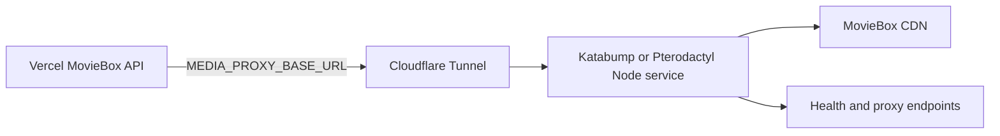
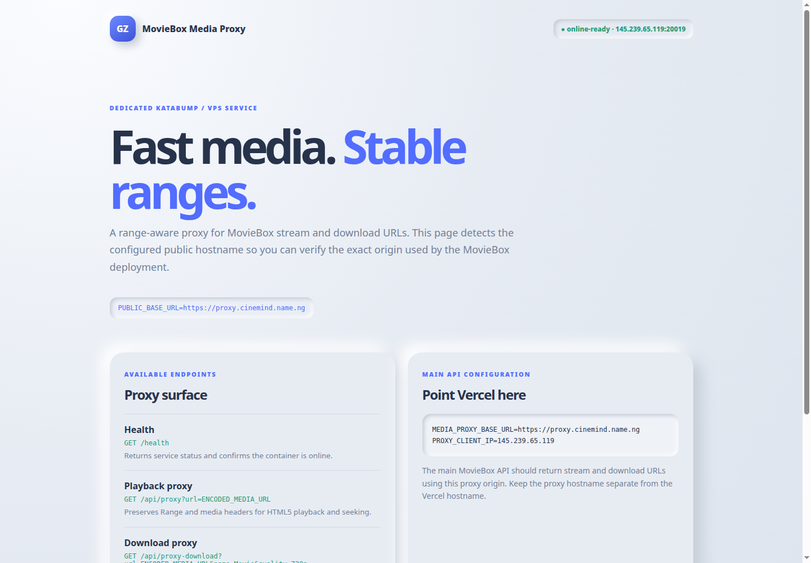
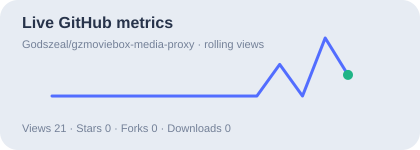

# GZMovieBox Media Proxy

> A dedicated Node 20 media gateway for MovieBox playback and downloads. It preserves byte ranges, forwards browser-style media headers, and runs independently from the Vercel JSON API.

[](https://nodejs.org/)
[](https://developers.cloudflare.com/cloudflare-one/connections/connect-networks/)
[](https://github.com/Godszeal/gzmovieboxapi-deploy)

## Project links

| Resource | Link |
|---|---|
| Public proxy hostname | [proxy.cinemind.name.ng](https://proxy.cinemind.name.ng/) |
| Direct Katabump origin | `http://145.239.65.119:20019` |
| Proxy repository | [github.com/Godszeal/gzmoviebox-media-proxy](https://github.com/Godszeal/gzmoviebox-media-proxy) |
| API and UI repository | [github.com/Godszeal/gzmovieboxapi-deploy](https://github.com/Godszeal/gzmovieboxapi-deploy) |

## Purpose

Vercel is useful for the JSON API and responsive playground, but media CDNs can reject serverless egress or require range-aware forwarding. This service runs as a persistent Node process and provides the media origin used by `MEDIA_PROXY_BASE_URL` in the API repository.

## Endpoints

| Endpoint | Methods | Purpose |
|---|---|---|
| `/` | GET | Neumorphic proxy landing page |
| `/health` | GET | Health JSON for monitors and panels |
| `/api` | GET | Proxy service metadata |
| `/api/proxy?url=ENCODED_URL` | GET, HEAD | Range-aware playback proxy |
| `/api/proxy-download?url=ENCODED_URL&name=Movie&quality=720p` | GET, HEAD | Range-aware download proxy |
| `/movieapi/proxy?url=ENCODED_URL` | GET, HEAD | Compatibility alias |
| `/movieapi/proxy-download?url=ENCODED_URL` | GET, HEAD | Compatibility download alias |

The service forwards `Range`, `Content-Range`, `Content-Length`, `Accept-Ranges`, `Content-Type`, `ETag`, and `Last-Modified`. Download responses also receive a safe `Content-Disposition` filename.

## Architecture



## Deploy to Katabump or Pterodactyl

1. Create a Node.js server with a persistent process.
2. Upload or clone this repository.
3. Allocate the service port used by the panel. The current deployment uses `20019`.
4. Add the environment variables below.
5. Use `npm install && npm start` as the startup command.
6. Confirm the logs contain `CLOUDFLARE TUNNEL IS CONNECTED`.
7. Test `/health` through the public hostname.

```env
PORT=YOUR_PANEL_PORT
PUBLIC_BASE_URL=YOUR_PROXY_DOMAIN_BASE_URL
PROXY_CLIENT_IP=YOUR_PANEL_IP
CLOUDFLARE_TUNNEL_ID=YOUR_TUNNEL_ID
CLOUDFLARE_TUNNEL_TOKEN=YOUR_ROTATED_TOKEN
CLOUDFLARE_SERVICE_URL=YOUR_PANEL_IP_ADDRESS
CDN_USER_AGENT=okhttp/4.12.0
FORCE_REFERER_DOMAIN=https://fmoviesunblocked.net/
```

The token must be entered in the panel's environment settings. Do not create or commit `.env`; this repository ignores it. If a token has been exposed in logs or Git history, revoke it and issue a replacement before deployment.

### Startup command

```bash
npm install && npm start
```

`npm install` installs the pinned `cloudflared` Node wrapper. When `npm start` is
used, `index.js` starts the proxy first and then launches the token connector in
the same Node process. It supplies the token through the child process
environment (not the command line), uses `--no-autoupdate`, prints a connection
banner after registration, and restarts the tunnel after an unexpected exit. If
the token is missing, the proxy still starts and prints a warning.

Expected logs:

```text
[cloudflare] Starting token connector for f64fc570-6fcc-4dff-bce2-7a2478f31f7c; origin=http://145.239.65.119:20019
GZMovieBox proxy listening on 0.0.0.0:20019
[cloudflare] Connected to tunnel f64fc570-6fcc-4dff-bce2-7a2478f31f7c for https://proxy.cinemind.name.ng
CLOUDFLARE TUNNEL IS CONNECTED
```

### Cloudflare public hostname

In Cloudflare Zero Trust, configure the token-authenticated tunnel with:

```text
Public hostname: proxy.cinemind.name.ng
Service type: HTTP
Service URL when cloudflared runs on Katabump: http://127.0.0.1:20019
```

The `127.0.0.1` value is correct only when Node and `cloudflared` run in the same Katabump container. If the connector runs on another machine, use the reachable Katabump origin `http://145.239.65.119:20019`, but a persistent production connector should run on Katabump.

## Deploy to Railway

1. Create a Railway service from this repository.
2. Set the start command to `npm install && npm start`, or allow Railway to install dependencies and use `npm start`.
3. Configure `PORT`, `PUBLIC_BASE_URL`, and the Cloudflare variables in Railway Variables.
4. Attach a persistent Railway domain or custom domain.
5. Ensure the service can reach the MovieBox CDN and Cloudflare edge.

Railway is a practical alternative when a persistent Node process and environment variables are available.

## Deploy to Render

Create a Render Web Service with:

```text
Runtime: Node
Build command: npm install
Start command: npm start
```

Add the same environment variables in Render. Use a persistent service rather than a short-lived job. If Render's outbound network or process policy prevents the required tunnel or CDN behavior, use Katabump/Pterodactyl instead.

## Deploy to another VPS or Node host

```bash
git clone https://github.com/Godszeal/gzmoviebox-media-proxy.git
cd gzmoviebox-media-proxy
npm ci
PORT=20019 npm start
```

Use a process manager such as systemd or PM2 for automatic restarts. Store the Cloudflare token in the process manager's secret environment, not in the repository.

## Connect the Vercel API

In [the API/UI repository](https://github.com/Godszeal/gzmovieboxapi-deploy), set:

```env
MEDIA_PROXY_BASE_URL=*******
```

After redeploying Vercel, `/api/media` and `/api/stream` should return URLs beginning with:

```text
https://proxy.cinemind.name.ng/api/proxy...
https://proxy.cinemind.name.ng/api/proxy-download...
```

## Testing

```bash
curl -i http://127.0.0.1:20019/health
curl -i https://proxy.****.name.ng/health
curl -H 'Range: bytes=0-1023' -D - \
  "https://proxy.****.name.ng/api/proxy?url=ENCODED_MEDIA_URL"
```

A healthy response is JSON with `status: ok`. A successful ranged media response normally returns `206 Partial Content`.

Cloudflare error `1033` means no connector is connected. A `502` indicates that the connector is online but cannot reach the configured origin service. Check the Katabump process logs, the allocation port, and the Cloudflare service URL.

## Responsive landing page screenshot



The screenshot shows the proxy origin landing page. When the Cloudflare connector and DNS route are healthy, the same page is available through [proxy.cinemind.name.ng](https://proxy.cinemind.name.ng/).

### GitHub actions and live metrics

[](https://github.com/Godszeal/gzmoviebox-media-proxy/stargazers)
[](https://github.com/Godszeal/gzmoviebox-media-proxy/fork)
[](https://github.com/Godszeal/gzmoviebox-media-proxy/stargazers)
[](https://github.com/Godszeal/gzmoviebox-media-proxy/network/members)
[](https://github.com/Godszeal/gzmoviebox-media-proxy/releases)
[](https://github.com/Godszeal/gzmoviebox-media-proxy/graphs/traffic)


## GitHub metrics


| Metric | Current value |
|---|---:|
| Stars | 0 |
| Forks | 0 |
| Watchers | 0 |
| Views, latest available 14-day window | 21 |
| Unique viewers, latest available window | 1 |
| Clones, latest available window | 5 |
| Unique cloners, latest available window | 2 |
| Release downloads | 0 |



 Open [Insights → Traffic](https://github.com/Godszeal/gzmoviebox-media-proxy/graphs/traffic) for the latest interactive view and clone data.


## Repository access

- [View the proxy repository](https://github.com/Godszeal/gzmoviebox-media-proxy)
- [View the API and frontend repository](https://github.com/Godszeal/gzmovieboxapi-deploy)
- [View the Godszeal GitHub profile](https://github.com/Godszeal)

The repository is public. Visitors can use the **Star** and **Fork** controls directly on the repository page.

## Security

Do not commit `.env`, Cloudflare tokens, API keys, upstream credentials, or private deployment values. Rotate any credential that has appeared in a public commit, log, screenshot, or shared terminal output.

## License

This project is distributed under the MIT License. See [LICENSE](LICENSE) if present in the repository.

## References

[1]: https://developers.cloudflare.com/cloudflare-one/connections/connect-networks/ "Cloudflare Tunnel documentation"
[2]: https://railway.com/ "Railway hosting"
[3]: https://render.com/ "Render hosting"
[4]: https://pterodactyl.io/project/introduction.html "Pterodactyl documentation"
[5]: https://docs.github.com/en/repositories/viewing-activity-and-data-for-your-repository/seeing-repository-traffic "GitHub repository traffic documentation"
